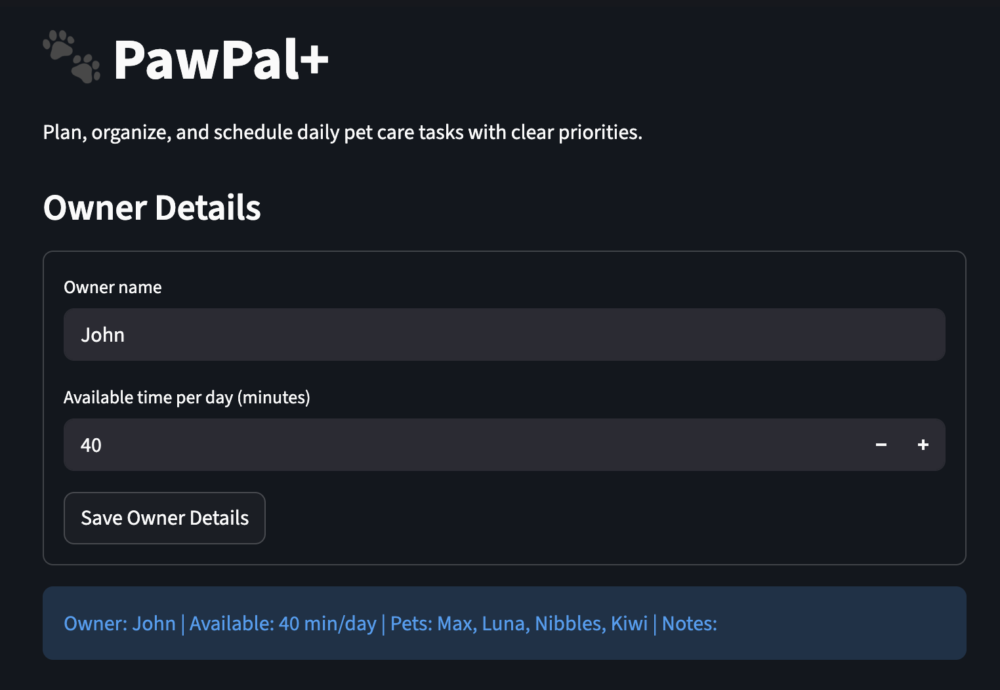
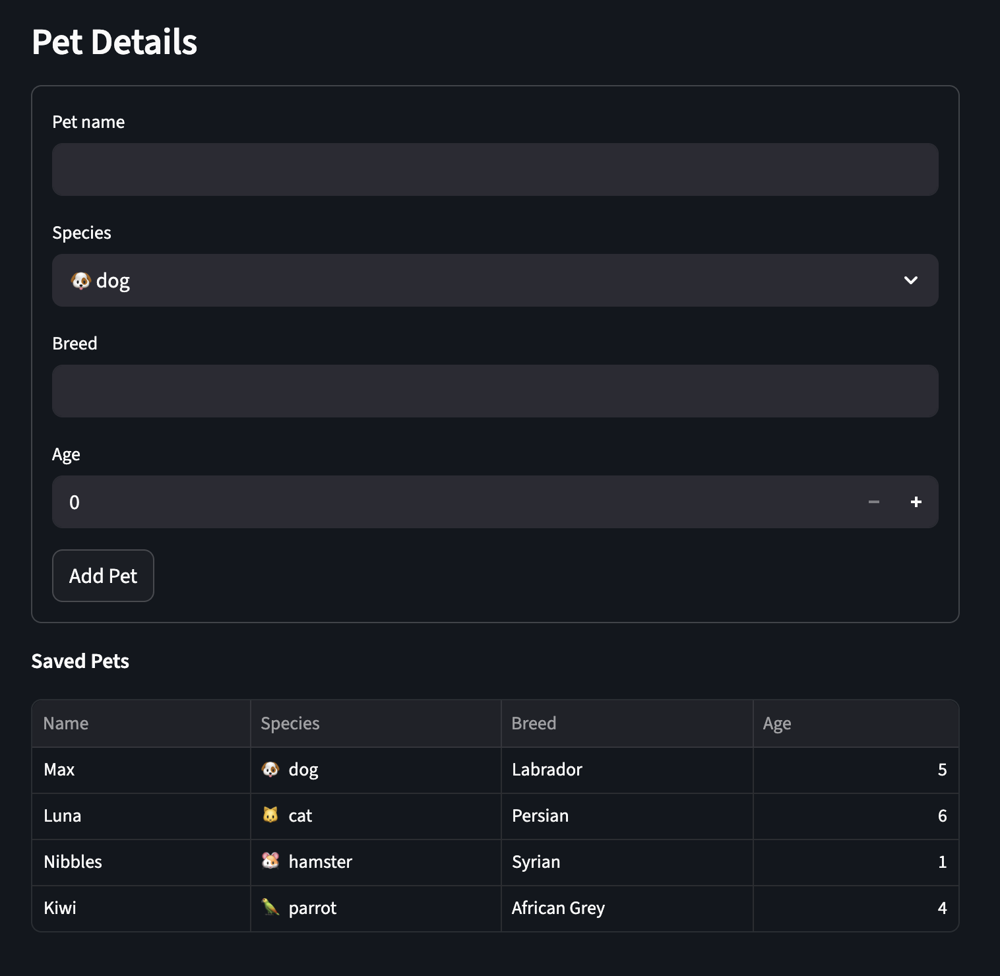
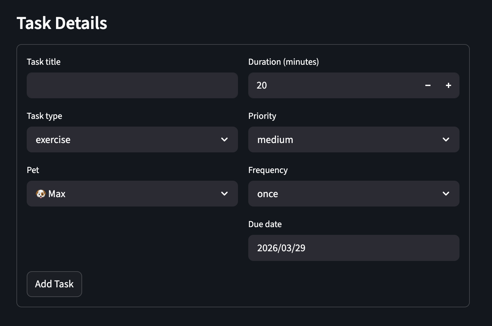
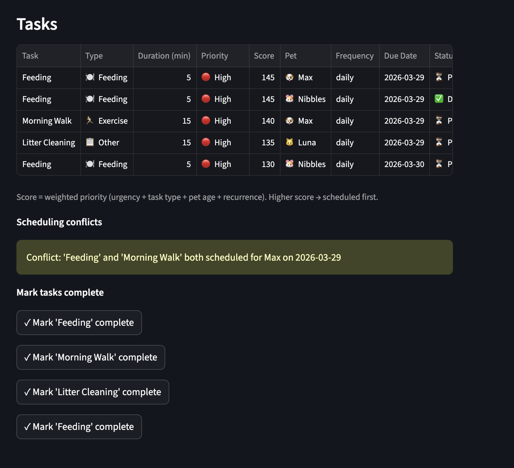
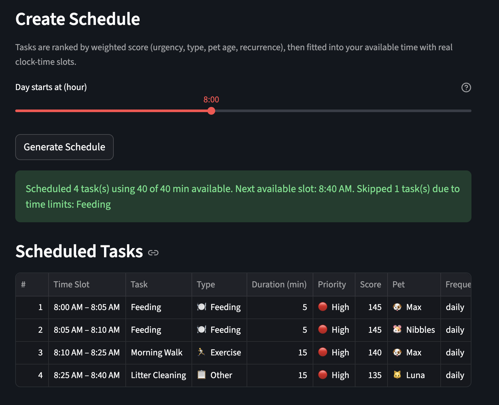

# PawPal+ (Module 2 Project)

PawPal+ is a Streamlit app that helps pet owners plan and manage daily care tasks efficiently.

---

## Scenario

A busy pet owner needs help staying consistent with pet care. They want an assistant that can:

- Track pet care tasks (walks, feeding, meds, enrichment, grooming, etc.)
- Consider constraints (time available, priority, owner preferences)
- Produce a daily plan and explain why it chose that plan

---

## How It Works

PawPal+ follows a simple three-step flow:

1. **Owner Setup** — Enter your name and how much time you have available each day (in minutes). This becomes the daily time budget the scheduler works within.

2. **Pet & Task Management** — Add one or more pets with their species, breed, and age. Then create care tasks for each pet — specifying the type (feeding, medical, exercise, etc.), duration, priority, recurrence, and due date.

3. **Schedule Generation** — PawPal+ ranks all pending tasks using a weighted scoring algorithm and fits as many as possible into your available time. Each scheduled task is assigned a real clock-time slot (e.g. 8:00 AM – 8:30 AM), and the app explains what was scheduled, what was skipped, and when your next free slot is.

---

## Features (Smarter Scheduling)

The scheduling logic includes:

- Priority-based scheduling with duration as a secondary factor to maximize task completion within a time budget  
- Time-constrained planning that schedules tasks up to the owner's available daily time  
- Task filtering by pet and completion status  
- Support for recurring tasks (daily, weekly) with automatic regeneration  
- Conflict detection for tasks assigned to the same pet on the same date

---

## Advanced Algorithmic Capability

To extend beyond basic priority-based scheduling, PawPal+ introduces two additional algorithmic improvements:

### Weighted Priority Scoring
Tasks are assigned a dynamic score based on multiple factors such as priority level, urgency (due date), task type, recurrence, and pet condition.  
This allows the system to prioritize tasks more intelligently than simple HIGH/MEDIUM/LOW sorting.

### Time-Based Scheduling (Next Available Slot)
Tasks are scheduled sequentially within the owner's available time, and each task is assigned a specific time window.  
The system also computes the next available free time slot after scheduling.

### Why this improves the system
These enhancements make the scheduler:
- more realistic (accounts for urgency and context)
- more flexible (adapts to different task types and pets)
- more interpretable (users can see why tasks are ordered and when to perform them)

### Role of Agent Mode
Agent Mode was used to iteratively refine the scoring logic and extend the scheduling algorithm from simple sorting to time-based planning.

## Getting Started

### Setup

```bash
python -m venv .venv
source .venv/bin/activate  # Windows: .venv\Scripts\activate
pip install -r requirements.txt
```

### Run the app

```bash
streamlit run app.py
```

---

## Testing PawPal+

The PawPal+ system includes an automated test suite to verify scheduling, recurrence, and conflict detection behavior.

### Run tests

```bash
python -m pytest
```

### What the tests cover

- **Schedule Generation Edge Cases**
  - Handles empty task lists without errors  
  - Ensures tasks are scheduled based on priority within the available time budget  

- **Recurrence Logic**
  - Verifies that marking a "daily" task as complete creates a new task for the next day  
  - Confirms that "one-time" tasks do not recur  

- **Conflict Detection**
  - Flags tasks with overlapping dates as conflicts  
  - Detects duplicate start times (same due date and duration)  
  - Ensures non-overlapping tasks are not flagged  
  - Handles boundary cases (consecutive days) without false positives  
  - Confirms tasks for different pets are not incorrectly flagged as conflicts  

- **System Stability**
  - Prevents runtime errors (e.g., division by zero when available time is zero)  

---

### Current limitation

The current `get_conflicts()` implementation uses `due_date` as the only time dimension.  
This limits conflict detection to day-level granularity.

Intra-day conflict detection (e.g., 09:00–09:30 vs 09:30–10:00) is not supported.  
Supporting this would require adding a `start_time` field to the `Task` model.

---

### Test results

All 14 tests are passing successfully.

---

### Confidence Level

⭐⭐⭐⭐☆ (4/5)

The system is reliable for current functionality, including scheduling, recurrence, and conflict detection.
Confidence is slightly reduced due to the absence of intra-day time-based conflict handling.

---

## Project Files

- `app.py` — Streamlit UI and state handling
- `pawpal_systems.py` — domain model (`Owner`, `Pet`, `Task`) and scheduler
- `tests/test_pawpal.py` — pytest coverage for core scheduling and model behavior

---

## Demo






